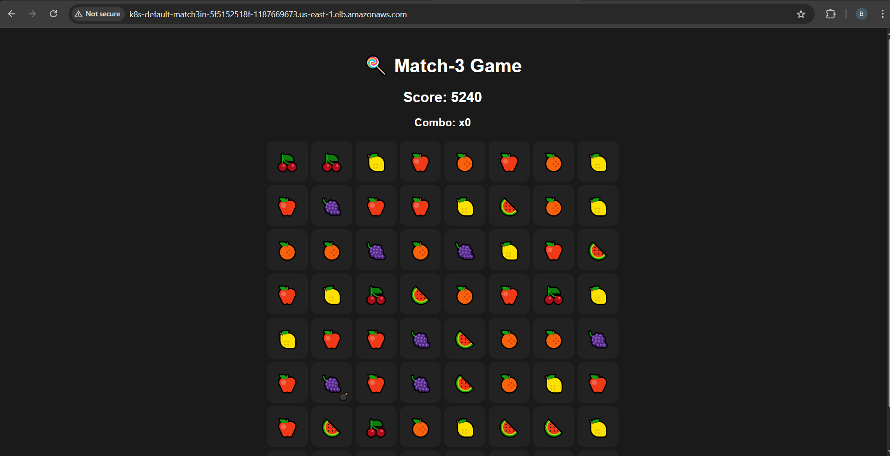
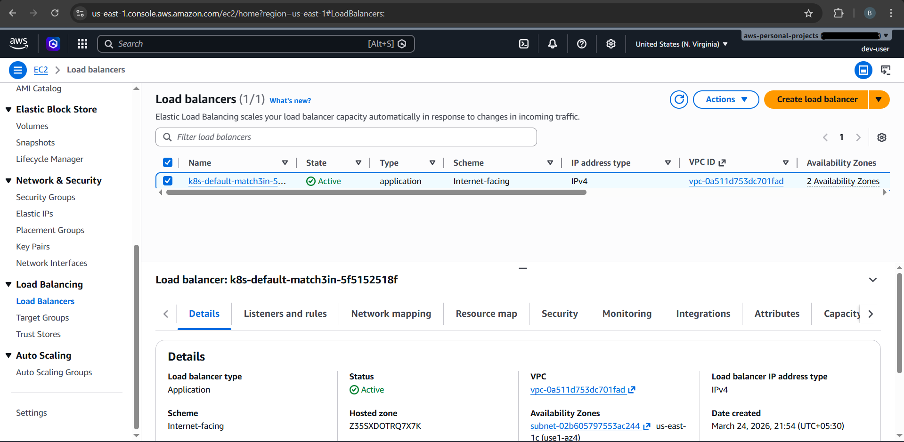
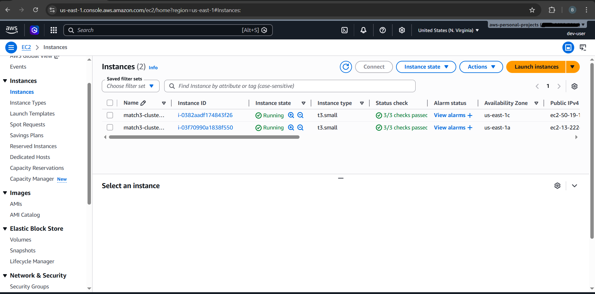
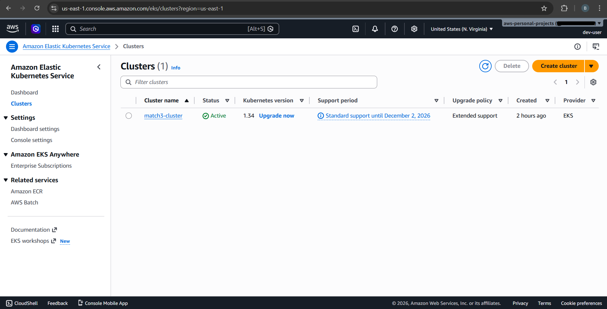
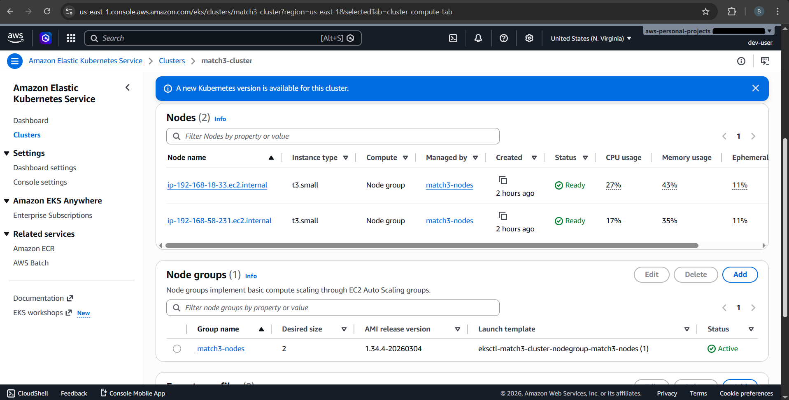
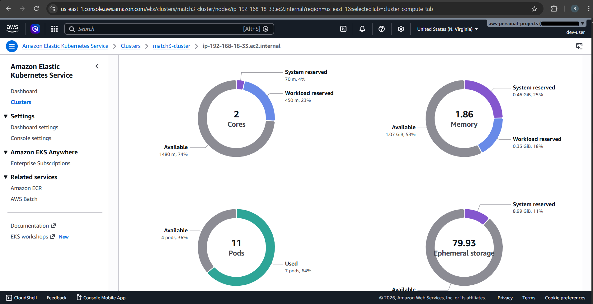

Cloud-Native Match-3 Game Deployment on AWS EKS

This project demonstrates an end-to-end cloud-native deployment of a React-based Match-3 game using modern DevOps practices on AWS.
The application is containerized using Docker, deployed on a Kubernetes cluster managed by Amazon EKS, and exposed to users via an Application Load Balancer (ALB). A CI/CD pipeline using GitHub Actions automates the build and deployment process.

Tech Stack

🔹 Frontend: React

🔹 Containerization: Docker, Nginx

🔹 Orchestration: Kubernetes (Amazon EKS)

🔹 CI/CD: GitHub Actions

🔹 Cloud Services:

  - Amazon ECR (Container Registry)
  - Amazon EKS (Kubernetes)
  - AWS ALB (Load Balancer)
  - AWS IAM (Access Control)
  - AWS VPC (Networking)

🔹  Helm, eksctl, kubectl

✅ Features
- Containerized React application using Docker (multi-stage build)
- Deployed on Kubernetes cluster (EKS) across multiple Availability Zones
- CI/CD pipeline using GitHub Actions
- Image storage and management using Amazon ECR
- Application exposed via AWS ALB using Kubernetes Ingress
- Secure AWS integration using IAM Roles for Service Accounts (IRSA)
- High availability through Multi-AZ deployment
- Real-world troubleshooting and debugging experience

✅  CI/CD Workflow
1. Code is pushed to GitHub
2. GitHub Actions workflow is triggered
3. Docker image is built
4. Image is pushed to Amazon ECR
5. Kubernetes deployment is updated
6. EKS pulls the latest image and updates pods

☸️Kubernetes Resources

🔹 Deployment
  - Manages application pods
  - Runs multiple replicas for scalability

🔹 Service
  - Exposes pods internally within the cluster

🔹 Ingress
  - Routes external traffic via ALB

🌐 Networking & High Availability
- Deployed across 2 Availability Zones
- Each AZ uses separate subnets
- ALB distributes traffic across nodes in different AZs
- Ensures fault tolerance and high availability

🔐 Security
- IAM Roles for Service Accounts (IRSA) configured using OIDC
- Fine-grained permissions for AWS Load Balancer Controller
- Secure communication between AWS services and Kubernetes

🟡 Key Learnings
- Kubernetes requires proper networking (CNI + DNS)
- AWS integrations depend heavily on IAM and OIDC configuration
- CI/CD pipelines improve deployment consistency
- Debugging cloud systems requires isolating issues across layers
- Multi-AZ architecture improves availability and resilience

📸 Screenshots

    
    
    
    
    
    

Author

Sasun Madhuranga

GitHub: https://github.com/sasunmadhuranga

